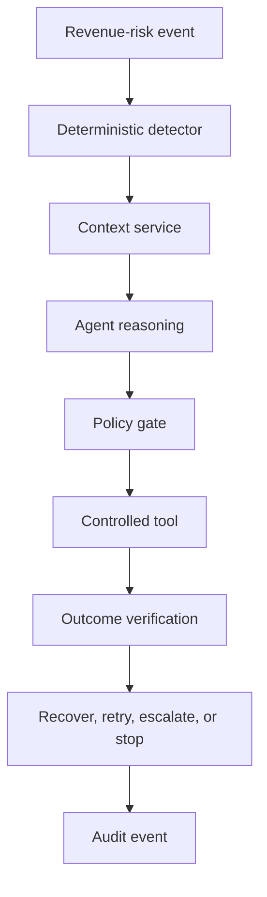
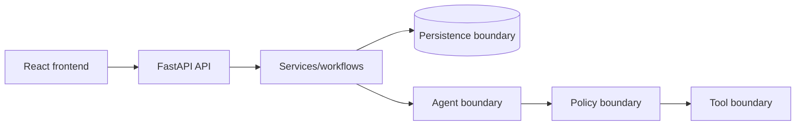

# Architecture

RevenueRescue AI separates event detection, context, reasoning, policy, tools, verification, persistence, and presentation. The future LLM is an untrusted decision proposer; deterministic policy remains the authority for permitted action.

Phase 1 implements only the API composition, health contract, configuration, logging, and minimal frontend. The rest is documented future architecture.
