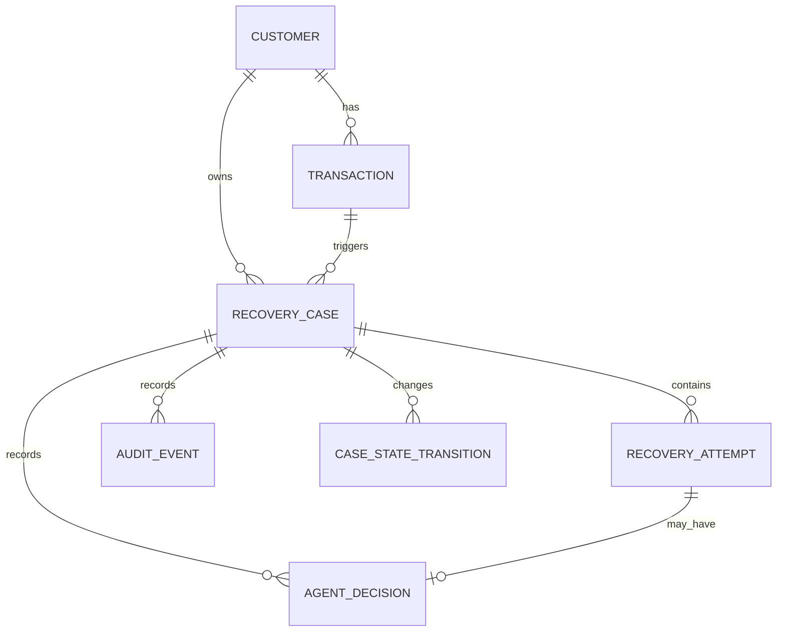
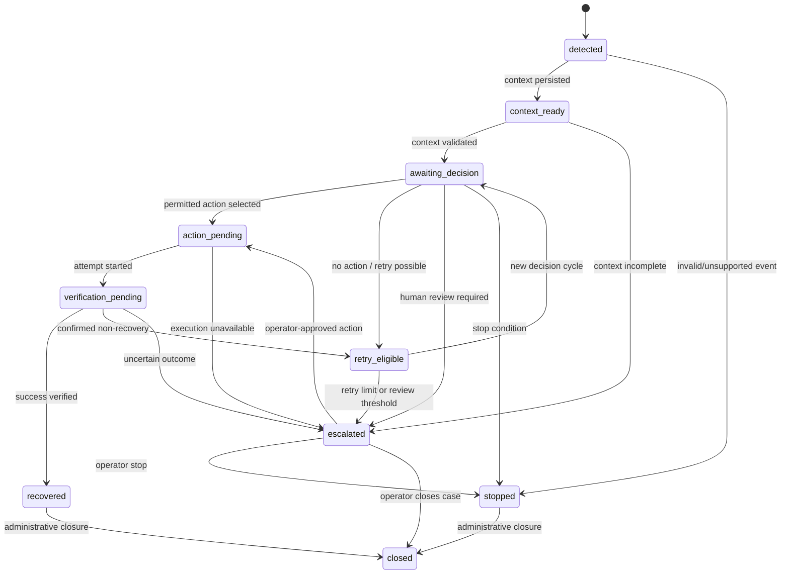

# Phase 2: Core Data & State System Design

**Project:** RevenueRescue AI  
**Primary author:** Karthikeya  
**Design status:** Implementation-ready proposal for review  
**Predecessor:** Phase 1 — Engineering Foundation & Architecture Baseline

## 1. Design purpose

Phase 2 establishes the persistent domain model and explicit recovery-case state machine that later phases will rely on. It must make revenue-risk episodes durable, queryable, resumable, auditable, and safe to extend without embedding agent reasoning or payment-provider behavior in the data layer.

The Phase 1 completion report records the foundation as complete, with two backend tests, linting, frontend build, and secret-hygiene checks passing. The acceptance checklist confirms that Phase 2 had not started and requires Karthikeya’s explicit approval before progression. This document is therefore a design proposal and does not claim that Phase 2 implementation has begun.

> **Phase 2 boundary:** create the data and state substrate; do not implement risk detection, LLM reasoning, payment execution, customer communication, or autonomous recovery behavior.

## 2. Proposed persistence decision

Phase 2 should use **SQLAlchemy 2.x ORM with Alembic migrations**, backed by SQLite for local development and PostgreSQL-compatible types and constraints for production-style environments. The application should depend on repository interfaces rather than directly coupling services to ORM sessions.

| Concern | Phase 2 decision | Rationale |
|---|---|---|
| ORM | SQLAlchemy 2.x typed declarative models | Keeps persistence explicit, testable, and provider-neutral |
| Migration tool | Alembic | Makes schema evolution reviewable and reproducible |
| Local database | SQLite file or in-memory test database | Low setup friction for synthetic development and tests |
| Production-shaped target | PostgreSQL-compatible relational database | Supports transactions, uniqueness, indexes, and concurrent workflows |
| Money | Integer minor units plus ISO currency code | Avoids floating-point monetary arithmetic |
| Time | UTC-aware timestamps | Provides consistent ordering across providers and operators |
| Identifiers | UUIDs generated by the application | Avoids exposing sequential business volume and supports distributed creation |
| JSON fields | Limited metadata/context payloads only | Preserves provider details without turning JSON into the primary data model |

This decision should be recorded as ADR-006 before implementation. No provider SDK, payment credential, or external database service is required in Phase 2.

## 3. Domain model

The central aggregate is **RecoveryCase**. A case represents one revenue-risk episode and owns its attempts, decisions, state transitions, and audit events. Transactions and customers are durable reference entities; they should not be duplicated for every retry.

### 3.1 Entities

| Entity | Required purpose | Important fields |
|---|---|---|
| `Customer` | Stable merchant/customer identity and recovery context | `id`, `external_customer_id`, `email`, `display_name`, `status`, `metadata`, timestamps |
| `Transaction` | Monetary event that may be at risk | `id`, `customer_id`, `provider`, `external_transaction_id`, `amount_minor`, `currency`, `status`, `failure_code`, `failure_message_safe`, `occurred_at`, `metadata`, timestamps |
| `RecoveryCase` | Lifecycle aggregate for one risk episode | `id`, `customer_id`, `trigger_transaction_id`, `case_key`, `state`, `priority`, `opened_at`, `last_state_changed_at`, `closed_at`, `version`, `metadata` |
| `RecoveryAttempt` | One bounded attempt to progress a case | `id`, `case_id`, `sequence_number`, `status`, `action_type`, `started_at`, `finished_at`, `outcome`, `provider_reference`, `idempotency_key`, `error_class`, `error_safe_message`, `metadata` |
| `AgentDecision` | Immutable record of a proposed or future agent decision | `id`, `case_id`, `attempt_id`, `decision_version`, `action_type`, `reason_code`, `rationale_safe`, `confidence`, `raw_response_hash`, `validation_status`, `created_at` |
| `AuditEvent` | Append-only business and state history | `id`, `case_id`, `event_type`, `from_state`, `to_state`, `actor_type`, `actor_id`, `correlation_id`, `event_time`, `payload_safe`, `sequence_number` |
| `CaseStateTransition` | Optional normalized transition record for queryable state history | `id`, `case_id`, `from_state`, `to_state`, `reason_code`, `actor_type`, `correlation_id`, `occurred_at`, `metadata` |

`CaseStateTransition` may be represented only through `AuditEvent` if the implementation team wants to minimize tables. The behavior must remain equivalent: every state change is durable, ordered, and auditable.

### 3.2 Enumerations

Enums should be defined in a domain module rather than repeated as free-form strings.

| Enum | Values for Phase 2 |
|---|---|
| `CustomerStatus` | `active`, `inactive`, `restricted` |
| `TransactionStatus` | `created`, `authorized`, `succeeded`, `failed`, `pending`, `cancelled`, `refunded`, `unknown` |
| `RecoveryCaseState` | `detected`, `context_ready`, `awaiting_decision`, `action_pending`, `verification_pending`, `recovered`, `retry_eligible`, `escalated`, `stopped`, `closed` |
| `RecoveryAttemptStatus` | `planned`, `started`, `succeeded`, `failed`, `uncertain`, `cancelled` |
| `ActionType` | `none`, `retry_payment`, `send_reminder`, `request_operator_review`, `stop` |
| `DecisionValidationStatus` | `not_validated`, `valid`, `invalid`, `rejected_by_policy` |
| `ActorType` | `system`, `operator`, `agent`, `provider`, `test` |

Phase 2 stores the enums and validates transitions; it does not execute any action represented by `ActionType`.

## 4. Relationship model

A case must reference a customer and its triggering transaction. A transaction may trigger multiple cases only when `case_key` differs for a separately identified risk episode; the default creation path must prevent duplicate cases for the same business event.

## 5. Database constraints and indexes

The database must enforce structural rules wherever possible. Application-level validation remains necessary for transition semantics and provider-specific rules.

| Rule | Database enforcement |
|---|---|
| External transaction identity is unique per provider | Unique constraint on `(provider, external_transaction_id)` |
| External customer identity is unique per provider or merchant namespace | Unique constraint on `(provider, external_customer_id)` or a future `merchant_id` scope |
| A case key is unique | Unique constraint on `case_key` |
| Attempt sequence is unique within a case | Unique constraint on `(case_id, sequence_number)` |
| Attempt idempotency key is globally unique | Unique constraint on `idempotency_key` |
| Money is non-negative | Check constraint `amount_minor >= 0` |
| Currency is normalized | Check constraint or application validator for three-letter uppercase code |
| Confidence is bounded | Check constraint `confidence IS NULL OR confidence >= 0 AND confidence <= 1` |
| Audit order is deterministic per case | Unique constraint on `(case_id, sequence_number)` |
| Softly deleted business records are avoided | No delete in normal lifecycle; use terminal state and audit history |

Recommended indexes include transaction status and occurred time, case state and last-state-change time, case customer ID, attempt case ID and sequence, audit case ID and sequence, and idempotency key.

## 6. State machine

### 6.1 State meanings

| State | Meaning | Terminal? |
|---|---|---:|
| `detected` | A risk event exists, but context has not been assembled | No |
| `context_ready` | Required transaction/customer context has been persisted and validated | No |
| `awaiting_decision` | The case is ready for a future decision provider | No |
| `action_pending` | A permitted action has been selected and awaits controlled execution | No |
| `verification_pending` | An attempt was initiated and its external result is not yet confirmed | No |
| `recovered` | Revenue outcome is confirmed recovered | Yes* |
| `retry_eligible` | The previous path did not recover the transaction, and another attempt may be considered | No |
| `escalated` | Automation stopped and operator review is required | No |
| `stopped` | Automation stopped because a safety or terminal condition applies | Yes |
| `closed` | The case is administratively complete after a terminal outcome or review | Yes |

`recovered` and `stopped` are business-terminal but may transition to `closed` for administrative closure. `escalated` remains non-terminal until an operator resolves it to `action_pending`, `stopped`, or `closed`.

### 6.2 Allowed transitions

### 6.3 Transition command contract

All state changes should pass through one domain service, for example `CaseStateService.transition(case_id, target_state, reason, actor, correlation_id)`. Callers must not assign `case.state` directly.

A transition command must:

1. Load the case with an optimistic version check.
2. Confirm the source and target states form an allowed edge.
3. Validate required preconditions for the target state.
4. Increment `version` and update `last_state_changed_at` atomically.
5. Append an audit/state-transition event in the same database transaction.
6. Return the updated case and emitted event identity.

## 7. State invariants

The following invariants are required before Phase 2 is accepted:

| Invariant | Expected behavior |
|---|---|
| No silent state mutation | Every state change has one audit event with source, target, reason, actor, and correlation ID |
| No invalid edge | A transition outside the matrix is rejected without modifying the case |
| Monotonic audit order | Case audit sequence increases by one inside the transaction |
| Optimistic concurrency | A stale `version` cannot overwrite a newer case state |
| No duplicate attempt | The same idempotency key cannot create two attempts |
| Attempt ordering | A new attempt sequence is greater than all prior attempts |
| One active attempt | At most one attempt may be `planned`, `started`, or `uncertain` for a case unless explicitly modeled as concurrent in a later ADR |
| Success protection | A `recovered` case cannot return to an action-producing state through ordinary transitions |
| Uncertainty preservation | An `uncertain` attempt leads to `verification_pending` or `escalated`, never directly to `retry_eligible` |
| Terminal protection | `closed` cannot transition to any non-closed state |
| Monetary integrity | Amount and currency do not change as a side effect of state transition |
| Audit safety | Audit payloads contain safe, bounded metadata and no secrets or raw credentials |

## 8. Repository and service boundaries

Phase 2 should add the following implementation units:

| Module | Responsibility |
|---|---|
| `backend/app/core/database.py` | Engine, session factory, and transaction-scoped session dependency |
| `backend/app/core/enums.py` | Shared domain enums and terminal-state helpers |
| `backend/app/models/base.py` | Declarative base and common timestamp/UUID mixins |
| `backend/app/models/*.py` | SQLAlchemy persistence models only |
| `backend/app/schemas/*.py` | Pydantic input/output contracts, separate from ORM models |
| `backend/app/repositories/*.py` | Query and persistence operations; no state-policy decisions |
| `backend/app/services/case_state_service.py` | Transition validation, optimistic concurrency, and audit emission |
| `backend/app/services/seed_service.py` | Deterministic synthetic fixture generation |
| `backend/app/workflows/*.py` | Not implemented in Phase 2 except a minimal persistence workflow if needed |
| `backend/migrations/` | Alembic environment and versioned migrations |
| `backend/tests/` | Model, repository, transition, constraint, and fixture tests |

The API layer may expose read-only inspection endpoints if needed for verification, but it must not become the owner of state-transition rules.

## 9. Synthetic data strategy

Synthetic data must be deterministic, clearly labeled, and safe to discard. A seed command should accept a seed value and create a small scenario set covering:

| Scenario | Purpose |
|---|---|
| Failed payment with complete customer context | Normal detected-case path |
| Failed payment with missing context | Escalation or stop precondition |
| Previously successful transaction | Success-protection test |
| Multiple failed attempts | Retry-limit and ordering test |
| Pending/unknown provider outcome | Uncertainty-preservation test |
| Duplicate event delivery | Idempotency and duplicate-case test |
| Escalated operator case | Manual resolution path |
| Closed historical case | Terminal-state read behavior |

Seed records must use clearly synthetic identifiers such as `synthetic_customer_001`; no real personal or payment data may be used. The seed operation should be repeatable or should fail clearly when a fixture already exists.

## 10. Testing strategy

Phase 2 acceptance requires tests at four levels.

| Level | Required coverage |
|---|---|
| Model/constraint | UUID creation, timestamps, money validation, enum validation, uniqueness, foreign keys |
| Repository | Create/read/update operations, idempotent lookup, attempt sequencing, audit append |
| State machine | Every allowed edge, every rejected edge, terminal protection, concurrency conflict, required preconditions |
| Fixture/integration | Seed scenarios, duplicate-event handling, restart/read-resume behavior, transaction rollback on failed transition |

The minimum state-machine test matrix should enumerate all allowed transitions and at least one representative invalid transition from every state. Tests must use an isolated SQLite database and must not call external providers.

## 11. Migration and rollout sequence

Implementation should proceed in this order:

1. Add the database dependency, settings, engine, and session lifecycle.
2. Add enums, base model, common timestamps, and UUID behavior.
3. Add customer and transaction models with constraints.
4. Add recovery case, attempt, decision, audit, and transition models.
5. Create the initial Alembic migration and verify upgrade from an empty database.
6. Implement repositories with focused tests.
7. Implement the state-transition service and audit transaction boundary.
8. Add deterministic synthetic fixtures and restart/read-resume tests.
9. Update `DATA_MODEL.md`, `ARCHITECTURE.md`, `API_DESIGN.md`, `FAILURE_HANDLING.md`, and the changelog.
10. Run the Phase 2 acceptance checklist and produce a completion report.

## 12. Explicit non-goals for Phase 2

Phase 2 must not add an LLM call, agent prompt, risk detector, payment retry, refund, customer message, production Razorpay integration, arbitrary tool invocation, dashboard workflow, or fabricated recovery metric. If a schema field anticipates a later phase, it must remain inert and documented as future-facing.

## 13. Phase 2 acceptance gate

Phase 2 is complete only when the schema can be created from a clean migration, all repositories are covered by tests, the state machine rejects invalid transitions, audit events are atomic with state changes, duplicate events are idempotently handled, synthetic fixtures are reproducible, and the completion report distinguishes implemented data/state behavior from future agent behavior.

Karthikeya must review and explicitly approve the Phase 2 completion report before Phase 3 — Revenue Risk Detection — begins.
